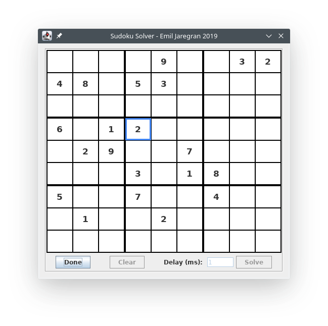
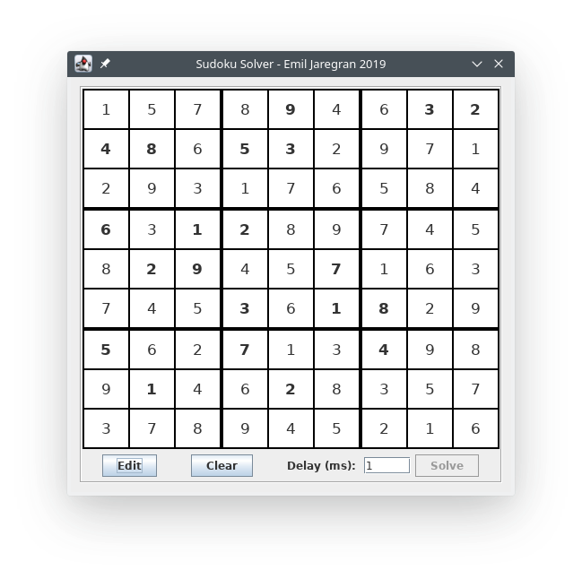

# sudoku_solver
A sudoku solver written in Java to practise recursive backtracking algorithms.

Editing numbers are done with the arrow keys and 0-9.
Erasing can also be done with backspace or delete. 
ESC to exit edit mode.

